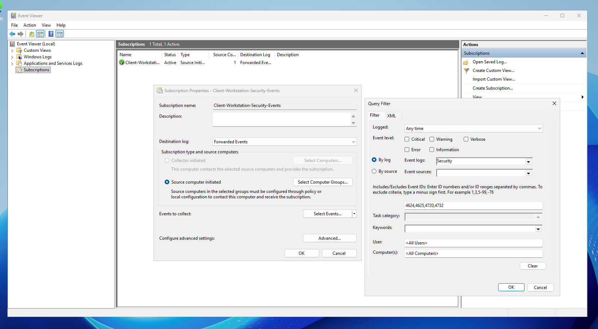
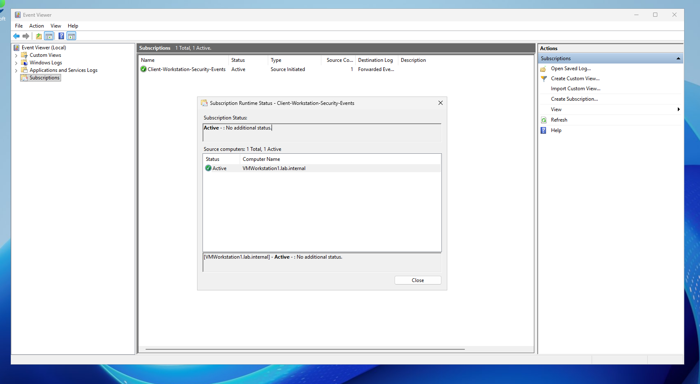
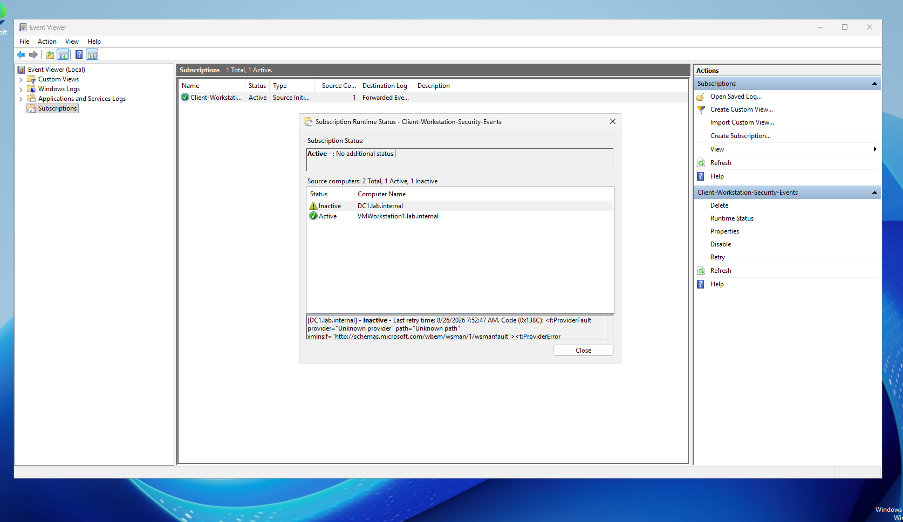
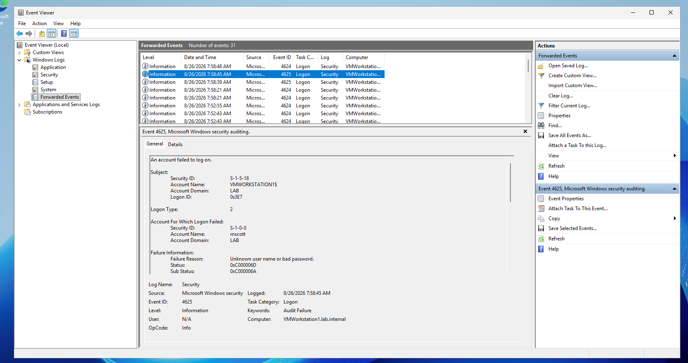

# wef-windows-event-forwarding
Source initiated Windows Event Forwarding deployment for centralized AD security log collection and WinRM telemetry pipeline.
# Windows Event Forwarding & Centralized Log Collection

This repository documents the deployment of Source-Initiated Windows Event Forwarding (WEF) across an Active Directory domain, enabling centralized endpoint security telemetry collection without third-party agent dependencies.

---

## Technical Overview

* **Log Collector / Subscription Server:** Domain Collector / DC (`DC1.lab.internal`)
* **Source Endpoint:** `VMWorkstation1.lab.internal`
* **Subscription Name:** `Client-Workstation-Security-Events`
* **Subscription Type:** Source Computer Initiated
* **Destination Log:** `Forwarded Events`
* **Monitored Security Event IDs:**
  * **4624:** Successful Account Logon
  * **4625:** Failed Account Logon
  * **4720:** User Account Created
  * **4732:** Member Added to Security Group

---

## Architecture & Configuration

### 1. Source-Initiated Subscription & Query Filtering
Created a source-initiated subscription targeting domain endpoints via Group Policy-assigned WinRM settings. Configured specific Security log event filters to optimize log volume and capture high value security metrics.

* **Subscription Model:** Source Computer Initiated
* **Event Log Target:** `Security`
* **Target Event IDs:** `4624, 4625, 4720, 4732`

---

## Endpoint Registration & Runtime Monitoring

### 2. Runtime Status Verification (`VMWorkstation1`)
Verified WinRM communication and subscription enrollment from domain-joined endpoints. Confirmed active status and heartbeat for `VMWorkstation1.lab.internal` within Subscription Runtime Status.

* **Status:** `Active - : No additional status.`
* **Connected Host:** `VMWorkstation1.lab.internal`

---

### 3. Subscription Management & Status Diagnostics
Monitored domain-wide collector status within Event Viewer subscriptions, ensuring accurate endpoint reporting and evaluating subscription error codes (`0x138C`) during collector self scans.

---

## Centralized Log Ingestion Verification

### 4. Forwarded Events Log Delivery
Validated real-time log transmission by inspecting the central **Forwarded Events** log container. Captured remote security events directly from `VMWorkstation1.lab.internal`, including an Audit Failure for the user account `mscott`.

* **Source Computer:** `VMWorkstation1.lab.internal`
* **Received Event ID:** `4625` - Failed Logon
* **Target Account:** `mscott`
* **Log Storage Path:** `Forwarded Events`

---

## Implementation Summary

1. Configured WinRM service settings and Subscription Manager via Group Policy
2. Established event subscription targeting specific active directory security event IDs.
3. Verified active WinRM communication channels from `VMWorkstation1.lab.internal`.
4. Confirmed remote log delivery into the central `Forwarded Events` event log for SIEM/SOC.
